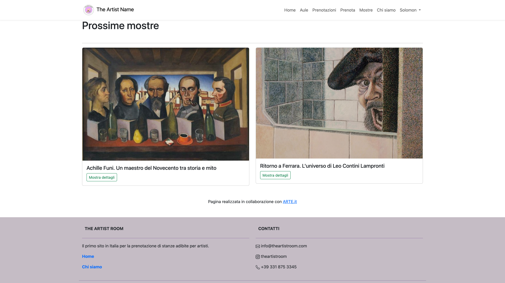

  

# The Artist Room

Repository containing the project for the Web Technologies class of the Computer Science course at the University of Ferrara, academic year 2023/24.

<h3>Members</h3>
<strong>Gaudenzi Luca</strong> - <strong>Marzola Gaia</strong> - <strong>Pirelli Giorgia</strong> - <strong>Taiwo Solomon Olamide</strong>

<h3>Screenshots</h3>

